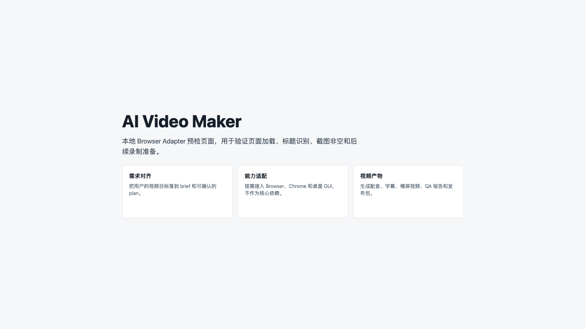

# AI Video Maker 使用指南

更新时间：2026-06-09

本文档是项目的正式使用手册，不是速查表。它说明用户如何通过 `ai-video-maker` skill 发起视频任务，如何按 gate 逐步确认，如何调用各个 workflow skill，以及仓库讲解、产品演示、终端演示、登录态页面演示和 YouTube 发布包等典型场景怎么走。

CLI/harness 不是用户主入口。它是 skill 内部用来保存 run 状态、记录 gate 确认、生成产物、做测试验证的执行底座。

## 1. 正确入口

推荐在 Codex 或支持 skills 的 AI agent 中复制下面这段话发起任务：

```text
请使用当前仓库的 ai-video-maker skill 帮我制作一个横屏 YouTube 视频。

需求：介绍 AI Video Maker 这个项目自己，演示它如何把一句视频需求变成视频包。

要求：
1. 先调用 video-brief，生成 brief 后停下来让我确认。
2. 我确认后再调用 video-plan。
3. plan 确认后继续 video-script。
4. 后续按 handoff 建议进入 voice-subtitle、edit-render、qa-revision、publish-package。
5. 不要自动上传 YouTube。
6. CLI/harness 只允许作为内部执行工具使用，不要让我手动记命令。
```

用户只需要描述目标、平台、受众、风格和边界。后续由 orchestrator skill 引导你调用子工作流，并在关键 gate 暂停等待确认。

典型回复方式：

```text
确认 brief，继续 video-plan
```

```text
确认 plan，继续 video-script
```

```text
脚本没问题，继续 voice-subtitle
```

如果需要录网页，再明确确认：

```text
确认 execution gate，允许录制这个本地网页。
```

说明：`ai-video-orchestrator` 是总调度角色名，当前仓库实际落地为 `skills/ai-video-maker/SKILL.md`。

## 2. Skills 工作流总览

目标链路：

```text
用户需求
-> ai-video-maker orchestrator
-> video-brief
-> brief gate
-> video-plan
-> plan gate
-> video-script
-> execution gate
-> browser-capture / GUI capture
-> voice-subtitle
-> edit-render
-> qa-revision
-> publish-package
-> upload gate
-> publish gate
```

当前仓库已经有 `skills/ai-video-maker/SKILL.md` 作为总入口，并已拆出 `video-brief`、`video-plan`、`video-script`、`browser-capture`、`terminal-capture`、`chrome-capture`、`desktop-capture`、`voice-subtitle`、`edit-render`、`qa-revision`、`publish-package`、`youtube-upload` 子 skill。

## 3. 引导方式

`ai-video-maker` / `ai-video-orchestrator` 会一步步告诉用户：

- 当前阶段在做什么。
- 本阶段建议调用哪个 skill。
- 完成后产出了哪些文件或内容。
- 用户需要检阅什么。
- 如果满意，下一步建议调用哪个 skill。
- 如果不满意，应该回到哪个 skill 返修。

每个子 skill 完成后也必须给出交接信息：

```yaml
skill: video-plan
status: ready_for_gate
outputs:
  - plan/storyboard.yml
  - plan/asset_plan.yml
  - plan/capability_plan.yml
review_checklist:
  - 章节结构是否符合预期
  - 旁白方向是否准确
  - 是否接受浏览器录制
next_skill_suggestion: video-script
next_gate: plan
user_action_required: true
```

也就是说，用户不会被要求自己记住完整流程。每一步完成后，系统都会明确说“请检阅这些内容，确认后建议进入下一个 skill”。

## 4. 每个 Skill 做什么

| Skill | 职责 | 输出 | Gate |
|---|---|---|---|
| `ai-video-maker` / `ai-video-orchestrator` | 总调度。理解用户需求，决定调用哪些子 workflow，管理确认点和风险边界 | run 目录、任务状态、下一步指令 | 全部 gate |
| `video-brief` | 把一句需求整理成目标、受众、平台、时长、风格、限制和成功标准 | `brief.yml` | `brief` |
| `video-plan` | 生成章节、storyboard、素材计划、能力计划和执行步骤 | `plan/storyboard.yml`、`plan/asset_plan.yml`、`plan/capability_plan.yml` | `plan` |
| `video-script` | 生成旁白稿、字幕草稿、屏幕操作台本和镜头提示 | `script/narration.zh.txt`、字幕草稿 | 软 review |
| `browser-capture` | 使用 Playwright 按 `script/screen_actions.yml` 操作本地或公开网页，完成逐步截图和短录屏；登录态 Chrome 另走 `$chrome` | `assets/browser/demo.webm`、`assets/browser/steps/*.png` | `execution` |
| `terminal-capture` | 执行已确认的安全终端命令，生成日志和终端卡片 | `assets/terminal/logs/*.txt`、`assets/terminal/cards/*.png` | `execution` |
| `chrome-capture` | 生成或记录已登录 Chrome 页面可见结果，不读取敏感会话数据 | `plan/chrome_operation.yml`、`qa/chrome_operation.md` | `execution` |
| `desktop-capture` | 生成或记录桌面 GUI 可见结果，不执行默认破坏性操作 | `plan/desktop_operation.yml`、`qa/desktop_operation.md` | `execution` |
| `voice-subtitle` | 生成 AI 配音、字幕，检查时长和文本映射 | `audio/narration.mp3`、`subtitles/captions.srt` | 软 review |
| `edit-render` | 合成画面、音频、字幕，自动剪辑并导出横屏或竖屏视频 | `render/final_16x9.mp4`、`render/final_9x16.mp4` | 软 review |
| `qa-revision` | 检查视频、音频、字幕、关键帧，生成 issue ledger 并路由返修 | `qa/report.md`、`qa/issues.yml`、关键帧截图 | 软 review |
| `publish-package` | 准备 YouTube 标题、简介、标签、章节、封面和上传清单；不自动上传 | `package/*` | `upload`、`publish` |
| `youtube-upload` | 生成 YouTube 上传计划和 dry-run，真实上传/发布前停在 gate | `upload/youtube_upload_plan.yml` | `upload`、`publish` |

## 5. 用户怎么参与

用户只在这些地方做决策：

| Gate | 用户确认什么 |
|---|---|
| `brief` | 视频目标、受众、平台、风格、时长和限制是否正确 |
| `plan` | 章节结构、镜头安排、素材计划、旁白方向和执行步骤是否可接受 |
| `execution` | 是否允许 AI 操作浏览器、Chrome 登录态或桌面 GUI |
| `upload` | 是否允许把本地视频文件上传到第三方平台 |
| `publish` | 是否允许公开视频或执行账号侧发布动作 |

如果用户没有明确确认，skill 不应该继续做有副作用的操作。

软 review 阶段用户可以直接说：

```text
继续
```

或者说：

```text
这段旁白太口水，回到 video-script 修改成更利落的技术讲解风格。
```

## 6. Harness 的位置

harness 是内部执行层，不是使用层。

它负责：

- 创建和恢复 `runs/<run_id>`。
- 保存 `brief.yml`、`approvals.yml`、`state.json`、`artifacts.yml`。
- 生成 storyboard、asset plan、capability plan、旁白、字幕、视频、QA 和发布包。
- 记录 `$browser`、`$chrome`、`$computer-use` 等能力适配器的执行结果。
- 让每一步可复现、可检查、可继续。

用户不需要先学习 CLI。只有在调试、开发、复现实操记录时，才直接运行 CLI。

## 7. 典型完整流程

### 7.1 用户发起需求

```text
请使用 ai-video-maker skill，做一个介绍本项目自己的横屏 YouTube 视频。
先输出 brief 和 plan，等我确认后再开始制作。
```

### 7.2 Orchestrator 建立 run

`ai-video-maker` skill 会在内部创建 run，并把用户需求转成结构化 brief。

期望产物：

```text
runs/<run_id>/
  brief.yml
  approvals.yml
  state.json
  artifacts.yml
```

`video-brief` 完成后会告诉用户：

```text
已生成 brief，请检阅目标、受众、平台、时长和风格。确认后建议进入 video-plan。
```

### 7.3 用户确认 brief

用户确认后，`video-plan` 才开始生成视频方案。

期望产物：

```text
runs/<run_id>/
  plan/storyboard.yml
  plan/asset_plan.yml
  plan/capability_plan.yml
  script/narration.zh.txt
```

`video-plan` 完成后会告诉用户：

```text
已生成 storyboard、asset plan 和 capability plan。请检阅章节结构、素材计划和执行步骤。确认后建议进入 video-script。
```

### 7.4 用户确认 plan

用户确认后，skill 根据 `capability_plan.yml` 判断是否需要 GUI 能力：

- 普通合成、AI 配音、字幕、剪辑：可直接走脚本化流程。
- 本地网页演示：优先 `$browser`。
- 需要用户登录态的网站：使用 `$chrome`，但必须先确认。
- 桌面软件、文件选择器、OBS、剪辑软件：使用 `$computer-use`，但必须先确认。

`video-script` 完成后会告诉用户：

```text
已生成旁白稿和屏幕操作台本。请检阅语气、节奏和操作顺序。满意后建议进入 browser-capture、terminal-capture、chrome-capture、desktop-capture 或 voice-subtitle。
```

### 7.5 制作和 QA

制作阶段应输出：

```text
runs/<run_id>/
  audio/narration.mp3
  subtitles/captions.srt
  render/final_16x9.mp4
  qa/report.md
```

QA 发现问题时，进入 `qa-revision`，重新调整脚本、字幕、画面或剪辑。

如果 plan 要求网页录制，需要先通过 `execution` gate，再进入 `browser-capture`。首次使用需安装 Playwright Chromium：

```bash
".venv/bin/python" -m playwright install chromium
```

### 7.6 准备发布包

发布包阶段应输出：

```text
runs/<run_id>/
  package/video.mp4
  package/thumbnail.png
  package/title.txt
  package/title_options.md
  package/description.md
  package/chapters.txt
  package/tags.txt
  package/metadata_qa.yml
  package/upload_checklist.md
```

上传和发布是账号侧动作，必须分别经过 `upload` 和 `publish` gate。

## 8. 当前实现状态

| 模块 | 状态 | 说明 |
|---|---|---|
| `ai-video-maker` orchestrator skill | 已有 P0 | 已有总入口，已对齐 skills-first 调度定位 |
| `video-brief` 子 skill | 已有 P0 | 定义需求对齐 workflow 和 brief gate |
| `video-plan` 子 skill | 已有 P0 | 定义 storyboard、素材计划、能力计划和 plan gate |
| `video-script` 子 skill | 已有 P0 | 定义旁白、字幕草稿和屏幕操作台本 workflow |
| `voice-subtitle` 子 skill | 已有 P0 | 接 `video-script` handoff，生成 AI 配音、正式字幕和 handoff |
| `browser-capture` 子 skill | 已实现 P2 | 接结构化 action DSL 和 execution gate，生成网页截图、短录屏和 handoff |
| `terminal-capture` 子 skill | 已实现 P6 | 接安全命令计划和 execution gate，生成终端日志、卡片和 handoff |
| `chrome-capture` 子 skill | 已实现 P7 | 生成和记录 Chrome 登录态页面可见结果，不读取敏感会话 |
| `desktop-capture` 子 skill | 已实现 P7 | 生成和记录桌面 GUI 可见结果 |
| `edit-render` 子 skill | 已实现 P5 | 接 `voice-subtitle` handoff，生成横屏/竖屏成片和 handoff |
| `qa-revision` 子 skill | 已实现 P3 | 接 `edit-render` handoff，生成 QA 报告、issues 和 handoff |
| `publish-package` 子 skill | 已实现 P4 | 接 `qa-revision` handoff，生成 YouTube 本地发布包并停在 upload gate |
| `youtube-upload` 子 skill | 已实现 P8 dry-run | 生成上传计划，真实上传/发布前停在 gate |
| run harness | 已实现 P1 | 支持 run/status/validate/capabilities |
| gate 机制 | 已实现 P1 | 支持 `brief`、`plan`、`execution`、`upload`、`publish` |
| capability dry-run | 已实现 P1 | 支持 `$browser`、`$chrome`、`$computer-use` 计划生成 |
| browser result 记录 | 已实现 P1 | 可把外部浏览器检查结果写回 run |
| 自动录屏 | 已有 P0 | 第一版使用 Playwright Chromium，暂不处理登录态 Chrome 和 YouTube Studio |
| YouTube 上传 dry-run | 已实现 P8 | dry-run 不发网络请求；真实上传/发布入口会检查 gate |

## 9. 内部开发调试方式

下面是开发者调试 harness 的命令，不是普通用户主路径。普通用户应该使用第 1 节的 `ai-video-maker` skill 对话方式。

验证 pipeline：

```bash
".venv/bin/ai-video-maker" validate --pipeline "pipeline.example.yml"
```

查看能力计划：

```bash
".venv/bin/ai-video-maker" capabilities --pipeline "pipeline.example.yml"
```

创建 demo run：

```bash
".venv/bin/ai-video-maker" run \
  --pipeline "pipeline.example.yml" \
  --run-id "demo" \
  --overwrite
```

推进 run：

```bash
".venv/bin/ai-video-maker" approve --run "runs/demo" --gate brief --summary "确认 brief"
".venv/bin/ai-video-maker" run --run "runs/demo"
".venv/bin/ai-video-maker" approve --run "runs/demo" --gate plan --summary "确认 plan"
".venv/bin/ai-video-maker" run --run "runs/demo"
```

查看状态：

```bash
".venv/bin/ai-video-maker" status --run "runs/demo"
```

生成 `video-script` 产物：

```bash
".venv/bin/ai-video-maker" script --run "runs/demo"
```

生成 `voice-subtitle` 产物：

```bash
".venv/bin/ai-video-maker" voice-subtitle --run "runs/demo"
```

可选网页录制：

```bash
".venv/bin/ai-video-maker" approve --run "runs/demo" --gate execution --summary "允许录制目标网页"
".venv/bin/ai-video-maker" browser-capture --run "runs/demo"
```

渲染、QA 和发布包：

```bash
".venv/bin/ai-video-maker" edit-render --run "runs/demo"
".venv/bin/ai-video-maker" qa-revision --run "runs/demo"
".venv/bin/ai-video-maker" publish-package --run "runs/demo"
```

运行测试：

```bash
".venv/bin/python" -m unittest discover -s "tests"
```

## 10. 下一步

为了让项目真正变成“用户调用 skills 即可完成视频任务”，下一阶段优先做：

1. 用更多真实主题打磨三类模板：仓库讲解、项目介绍、产品演示。
2. 增加返修回路，让 `qa-revision` 自动提示并执行局部重做。
3. 增加封面图、章节描述和多平台版本。
4. 在 `upload` 和 `publish` gate 后，再接 YouTube API 或 YouTube Studio 辅助上传。

详细规划见：[AI Video Maker 开发规划：P1 到 P9](./开发规划-P1到P9.md)。

## 11. 详细使用范例

### 11.1 场景 A：介绍开源仓库并输出横屏 YouTube 版

适合内容：

- 项目自我介绍。
- 开源仓库讲解。
- README、目录结构、安装和运行说明。
- 适合第一条 demo 视频。

用户输入示例：

```text
请用 ai-video-maker skill 做一个横屏 YouTube 视频。
主题：介绍这个开源仓库自己，演示它怎么把一句需求变成视频包。
要求：先出 brief，等我确认后再继续。
```

推荐流程：

1. `video-brief` 输出需求对齐结果。
2. 用户确认 `brief` gate。
3. `video-plan` 生成 storyboard、asset plan、capability plan。
4. 用户确认 `plan` gate。
5. `video-script` 生成旁白、字幕草稿和镜头提示。
6. `voice-subtitle` 生成配音和字幕。
7. `edit-render` 按 `youtube_16x9` 渲染成片。
8. `qa-revision` 检查成片，必要时返修。
9. `publish-package` 生成标题、简介、章节、封面和上传清单。
10. `youtube-upload --dry-run` 只生成上传计划，不自动发到平台。

需要用户确认的点：

- brief 是否对齐。
- plan 是否可执行。
- 是否允许任何浏览器、Chrome 或桌面操作。
- 是否允许上传。
- 是否允许发布。

建议查看的产物：

- `brief.yml`
- `plan/storyboard.yml`
- `plan/asset_plan.yml`
- `plan/capability_plan.yml`
- `script/narration.zh.txt`
- `audio/narration.mp3`
- `subtitles/captions.srt`
- `render/final_16x9.mp4`
- `qa/report.md`
- `package/*`

参考截图：


### 11.2 场景 B：本地网页产品演示

适合内容：

- 本地服务启动说明。
- 产品功能走查。
- 浏览器页面操作演示。
- 仓库里的 Web UI、Demo 页面、文档站。

用户输入示例：

```text
请把这个本地网页做成产品演示视频，重点展示首页、搜索和结果页。
如果需要录网页，请先让我确认 execution gate。
```

推荐流程：

1. `video-brief` 对齐演示目标和页面范围。
2. `video-plan` 生成页面级 storyboard 和浏览器操作计划。
3. `video-script` 输出旁白与 `screen_actions` 草稿。
4. 用户确认 `execution` gate。
5. `browser-capture` 用 Playwright 录制页面操作和截图。
6. `voice-subtitle` 生成配音和字幕。
7. `edit-render` 组合页面录制、字幕和卡片。
8. `qa-revision` 检查字幕遮挡、页面抖动和节奏。

如果需要先验证页面是否可录，建议先跑浏览器预检结果记录：

```bash
".venv/bin/ai-video-maker" browser-result \
  --run "runs/<run_id>" \
  --screenshot "path/to/screenshot.png" \
  --url "http://127.0.0.1:3000" \
  --title "Demo Page" \
  --non-blank
```

参考截图：



### 11.3 场景 C：终端安装、运行和测试演示

适合内容：

- CLI 安装教程。
- 开发环境搭建。
- 测试命令讲解。
- 终端输出结果展示。

用户输入示例：

```text
请做一个终端演示视频，演示这个项目怎么安装、怎么验证、怎么跑测试。
终端命令要先由你审核，别让我手动猜。
```

推荐流程：

1. `video-brief` 确认演示目标。
2. `video-plan` 规划终端命令、输出片段和节奏。
3. `video-script` 生成讲解台词。
4. `terminal-capture` 只执行已确认且安全的命令。
5. `voice-subtitle` 生成配音和字幕。
6. `edit-render` 把终端卡片和旁白合成视频。
7. `qa-revision` 检查命令可读性和字幕位置。

典型适合录制的命令：

```bash
".venv/bin/ai-video-maker" skills validate
".venv/bin/ai-video-maker" validate --pipeline "pipeline.example.yml"
".venv/bin/python" -m unittest discover -s "tests"
```

参考截图：


### 11.4 场景 D：登录态网页、YouTube Studio 或桌面软件

适合内容：

- 登录后才能看到的页面。
- YouTube Studio 里准备发布。
- 桌面剪辑软件、OBS、文件选择器。

用户输入示例：

```text
请把这个任务做成视频，并在需要登录态页面或桌面工具时先提醒我确认。
不要读取 cookie、密码或 token，只记录可见结果。
```

推荐流程：

1. `video-brief` 明确是否需要登录态资源。
2. `video-plan` 选择 `chrome-capture` 或 `desktop-capture`。
3. 用户确认 `execution` gate。
4. `chrome-capture` 只记录可见页面结果，不读敏感信息。
5. `desktop-capture` 只记录桌面 GUI 可见结果。
6. `publish-package` 生成上传清单。
7. `youtube-upload` 先 dry-run，再决定是否继续 `upload` / `publish`。

关键限制：

- 不读取 cookie、localStorage、密码或 session token。
- 不默认执行上传和公开视频发布。
- `upload` 和 `publish` 必须分开确认。

### 11.5 场景 E：只想先看发布包，不上传

适合内容：

- 需要先看标题、简介、封面和章节。
- 还没决定是否上 YouTube。

推荐流程：

1. 跑到 `qa-revision`。
2. 执行 `publish-package`。
3. 检查 `package/title.txt`、`package/description.md`、`package/chapters.txt`、`package/thumbnail.png`。
4. 只跑 `youtube-upload --dry-run`。
5. 等用户确认 `upload` 和 `publish` gate 后再往下走。

## 12. 各模块怎么单独用

如果你只想调试某个模块，不必跑完整链路，可以直接调用对应命令。

| 模块 | 作用 | 典型命令 | 需要确认 |
|---|---|---|---|
| `ai-video-maker` | 总调度，负责推荐下一步 | `".venv/bin/ai-video-maker" next --run "runs/<run_id>"` | 否 |
| `video-brief` | 需求对齐 | 通过 skill 对话触发 | `brief` |
| `video-plan` | 生成 storyboard、asset plan、capability plan | 通过 skill 对话触发 | `plan` |
| `video-script` | 生成旁白和镜头脚本 | `".venv/bin/ai-video-maker" script --run "runs/<run_id>"` | 否 |
| `browser-capture` | 录制本地或公开网页 | `".venv/bin/ai-video-maker" browser-capture --run "runs/<run_id>"` | `execution` |
| `terminal-capture` | 录终端安全命令和输出卡片 | `".venv/bin/ai-video-maker" terminal-capture --run "runs/<run_id>"` | `execution` |
| `chrome-capture` | 记录登录态浏览器可见结果 | `".venv/bin/ai-video-maker" chrome-capture --run "runs/<run_id>"` | `execution` |
| `desktop-capture` | 记录桌面 GUI 可见结果 | `".venv/bin/ai-video-maker" desktop-capture --run "runs/<run_id>"` | `execution` |
| `voice-subtitle` | 生成配音和字幕 | `".venv/bin/ai-video-maker" voice-subtitle --run "runs/<run_id>"` | 否 |
| `edit-render` | 合成并渲染成片 | `".venv/bin/ai-video-maker" edit-render --run "runs/<run_id>" --profiles youtube_16x9,shorts_9x16` | 否 |
| `qa-revision` | 质检并生成返修建议 | `".venv/bin/ai-video-maker" qa-revision --run "runs/<run_id>"` | 否 |
| `publish-package` | 生成上传包 | `".venv/bin/ai-video-maker" publish-package --run "runs/<run_id>"` | `upload` / `publish` |
| `youtube-upload` | 生成上传计划或 dry-run | `".venv/bin/ai-video-maker" youtube-upload --run "runs/<run_id>" --dry-run` | `upload` / `publish` |

## 13. Harness 目录和产物怎么读

一个标准 run 通常会长成这样：

```text
runs/<run_id>/
  brief.yml
  approvals.yml
  state.json
  artifacts.yml
  plan/
  script/
  audio/
  subtitles/
  assets/
  render/
  qa/
  package/
```

这些文件的含义很直接：

- `brief.yml`：用户需求对齐结果。
- `approvals.yml`：每个 gate 的确认记录。
- `state.json`：当前阶段和调度状态。
- `artifacts.yml`：本次 run 的产物索引。
- `plan/*`：分镜、素材和能力计划。
- `script/*`：旁白、字幕草稿、屏幕操作脚本。
- `audio/*`：配音音频。
- `subtitles/*`：字幕文件。
- `render/*`：渲染输出。
- `qa/*`：质检结果和返修点。
- `package/*`：发布包。

常用内部命令：

```bash
".venv/bin/ai-video-maker" status --run "runs/<run_id>"
".venv/bin/ai-video-maker" next --run "runs/<run_id>"
".venv/bin/ai-video-maker" approve --run "runs/<run_id>" --gate plan --summary "确认 plan"
```

## 14. 安装、测试和排障

如果你希望 AI 直接把环境部署好，可以先看：[环境部署提示词](./环境部署提示词.md)。

安装 skills：

```bash
".venv/bin/python" scripts/install_skills.py --dry-run --target "<codex-skills-dir>"
".venv/bin/python" scripts/install_skills.py --copy --target "<codex-skills-dir>"
".venv/bin/python" scripts/install_skills.py --link --target "<codex-skills-dir>"
```

常用验证：

```bash
".venv/bin/ai-video-maker" skills validate
".venv/bin/ai-video-maker" validate --pipeline "pipeline.example.yml"
".venv/bin/python" -m unittest discover -s "tests"
git diff --check
```

常见问题：

- Python 版本太新时，优先切回 3.12 虚拟环境。
- 如果 `browser-capture` 报错，先确认 Playwright Chromium 已安装。
- 如果 `chrome-capture` 或 `desktop-capture` 没有确认 `execution` gate，就不要继续。
- 如果 `youtube-upload` 只是 dry-run，这是正常行为，真实上传必须单独确认。
