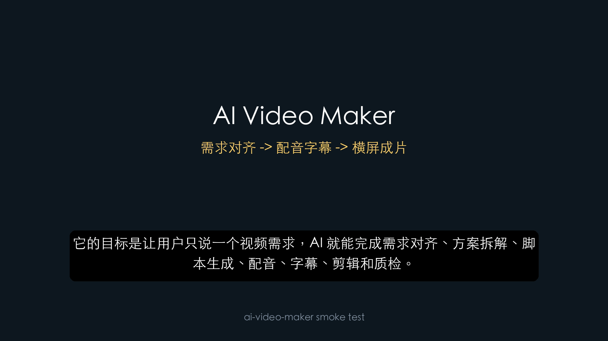

# 实操记录：AI Video Maker 自我介绍横屏 Demo

更新时间：2026-06-08

## 1. 本次对齐结论

本次实操先做最小闭环，不碰复杂 GUI 和上传。

确认事项：

| 项 | 决策 |
|---|---|
| 项目通用名称 | `AI Video Maker` |
| CLI/skill 名称 | `ai-video-maker` |
| 第一个实操主题 | 介绍项目自己 |
| 视频平台假设 | YouTube |
| 视频比例 | 横屏 `16:9` |
| 分辨率 | `1920x1080` |
| 是否做竖屏 | 暂不做 |
| 是否上传 YouTube | 暂不上传，只生成本地视频和发布包思路 |
| 是否使用 GUI | 暂不使用，先验证核心制作链路 |

GitHub 远程仓库是否改名不在本次范围内。公开仓库重命名会影响 URL，需要单独确认。

## 2. 本次目标

验证这条最小制作链路：

```text
项目自我介绍旁白
-> edge-tts 生成 AI 配音和字幕
-> MoviePy/Pillow 渲染横屏视频
-> Auto-Editor 自动剪辑
-> 抽关键帧截图
-> 写入实操记录
```

这条链路是后续 harness 的基础。后续再把 `$browser`、`$chrome`、`$computer-use` 接入素材采集和上传阶段。

## 3. 旁白稿

旁白稿位于：

```text
samples/demo_narration.txt
```

内容：

```text
这是 AI Video Maker 的第一条自我介绍 Demo。
它的目标是让用户只说一个视频需求，AI 就能完成需求对齐、方案拆解、脚本生成、配音、字幕、剪辑和质检。
当前版本先验证横屏 YouTube 视频链路：从文本旁白生成音频和字幕，再渲染成带字幕的 MP4。
后续我们会继续接入浏览器、Chrome 登录态和桌面操作能力，用来录制真实演示并准备发布包。
```

## 4. 执行命令

运行最小验证脚本：

```bash
./scripts/run_smoke_test.sh
```

该脚本完成：

1. 调用 `edge-tts` 生成 AI 配音。
2. 输出字幕文件。
3. 调用 `scripts/render_smoke_video.py` 渲染带字幕横屏视频。
4. 调用 `auto-editor` 生成自动剪辑版本。

抽取关键帧截图：

```bash
ffmpeg -y -ss 6 -i "output/smoke/demo_video.mp4" \
  -frames:v 1 -update 1 \
  "docs/assets/ai-video-maker-demo-frame-6s.png"
```

## 5. 生成产物

生成产物位于：

```text
output/smoke/
```

注意：`output/smoke/` 是生成产物目录，已被 `.gitignore` 忽略，不会提交到仓库。

| 文件 | 说明 |
|---|---|
| `demo_narration.mp3` | AI 配音 |
| `demo_narration.srt` | 字幕文件 |
| `demo_video.mp4` | 横屏原始渲染视频 |
| `demo_video_auto.mp4` | Auto-Editor 自动剪辑视频 |

视频信息：

| 文件 | 时长 | 大小 |
|---|---:|---:|
| `demo_video.mp4` | 34.20 秒 | 1,134,440 字节 |
| `demo_video_auto.mp4` | 32.71 秒 | 833,617 字节 |

截图文件提交到文档资产目录：

```text
docs/assets/ai-video-maker-demo-frame-6s.png
```

## 6. 关键帧截图



截图检查结论：

- 画面是 `1920x1080` 横屏。
- 主标题显示 `AI Video Maker`。
- 副标题显示“需求对齐 -> 配音字幕 -> 横屏成片”。
- 字幕已烧录进画面。
- 画面非黑屏，布局可读。

## 7. 字幕片段

生成的字幕片段：

```srt
1
00:00:00,100 --> 00:00:04,412
这是 AI Video Maker 的第一条自我介绍 Demo。

2
00:00:04,362 --> 00:00:15,687
它的目标是让用户只说一个视频需求，AI 就能完成需求对齐、方案拆解、脚本生成、配音、字幕、剪辑和质检。
```

## 8. 本次验证结果

通过：

- `edge-tts` 能生成中文 AI 配音。
- 字幕能从旁白稿生成。
- MoviePy/Pillow 能渲染横屏视频。
- 字幕能烧录进画面。
- Auto-Editor 能处理生成视频。
- 文档截图能作为可信记录提交。

未做：

- 没有录制浏览器 Demo。
- 没有调用 `$browser`。
- 没有调用 `$chrome`。
- 没有调用 `$computer-use`。
- 没有上传 YouTube。

## 9. 下一步

下一步进入 P0 harness：

```text
pipeline.example.yml
-> runs/<run_id>/
-> brief.yml
-> approvals.yml
-> state.json
-> narration
-> subtitles
-> render
-> qa
-> package
```

目标是把本次手动 smoke flow 变成正式 CLI：

```bash
ai-video-maker new --template general_demo
ai-video-maker render --run runs/<run_id>
ai-video-maker qa --run runs/<run_id>
ai-video-maker package --run runs/<run_id>
```

