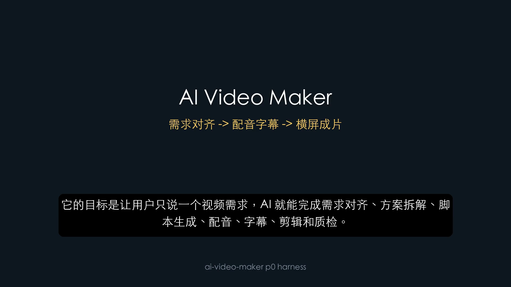

# 实操记录：P0 Harness 自我介绍 Demo

更新时间：2026-06-08

## 1. 本次目标

本次实操把原来的 smoke 脚本升级成 P0 harness。

目标链路：

```text
ai-video-maker run-demo
-> runs/<run_id>/
-> brief.yml
-> approvals.yml
-> state.json
-> artifacts.yml
-> voice/subtitles
-> render/final_16x9.mp4
-> qa/report.md
-> package/
```

本次仍然只做横屏 YouTube 版，不做竖屏，不上传 YouTube，不调用 `$browser`、`$chrome`、`$computer-use`。

## 2. 远程仓库改名

已将公开仓库从旧项目名改为：

```text
ai-video-maker
```

本地 `origin` 指向：

```text
https://github.com/ljxpython/ai-video-maker.git
```

注意：GitHub 远程 URL 是公开项。文档中不再写本机绝对路径。

## 3. P0 新增工程内容

新增 Python 包：

```text
src/ai_video_maker/
```

核心模块：

| 文件 | 说明 |
|---|---|
| `cli.py` | CLI 入口 |
| `context.py` | run 目录、state、approvals 初始化 |
| `artifacts.py` | 产物记录 |
| `stages.py` | voice/render/qa/package 阶段 |
| `renderer.py` | MoviePy/Pillow 横屏渲染器 |
| `srt.py` | SRT 解析 |
| `io.py` | YAML/JSON 读写 |

新增包配置：

```text
pyproject.toml
```

新增依赖：

```text
PyYAML
```

## 4. CLI 命令

查看帮助：

```bash
.venv/bin/ai-video-maker --help
```

当前支持命令：

```text
new
approve
voice
render
qa
package
run-demo
```

创建 run：

```bash
.venv/bin/ai-video-maker new \
  --run-id p0-cli-check \
  --overwrite
```

完整运行 P0 demo：

```bash
.venv/bin/ai-video-maker run-demo \
  --run-id p0-self-intro \
  --overwrite
```

## 5. Run 目录结构

本次生成：

```text
runs/p0-self-intro/
```

关键文件：

```text
brief.yml
approvals.yml
state.json
artifacts.yml
plan/storyboard.yml
plan/asset_plan.yml
script/narration.zh.txt
audio/narration.mp3
subtitles/captions.srt
render/draft.mp4
render/final_16x9.mp4
qa/ffprobe.json
qa/report.md
qa/screenshots/frame_6s.png
package/video.mp4
package/title.txt
package/description.md
package/tags.txt
package/upload_checklist.md
```

`runs/` 是运行产物目录，默认被 `.gitignore` 忽略，避免把视频和中间产物提交进仓库。

## 6. 状态结果

`state.json` 最终状态：

```json
{
  "run_id": "p0-self-intro",
  "status": "package_ready",
  "current_stage": "package"
}
```

这说明 P0 harness 已完成：

```text
new -> voice -> render -> qa -> package
```

## 7. 产物记录

`artifacts.yml` 记录了关键产物：

```text
brief
storyboard
narration_script
voice
captions
draft_video
final_video
qa_report
qa_screenshot
package_video
upload_checklist
```

这一步很关键。后续断点续跑、上传包生成、QA 回溯都依赖 artifact manifest。

## 8. 视频结果

最终视频：

```text
runs/p0-self-intro/render/final_16x9.mp4
```

视频信息：

| 项 | 结果 |
|---|---:|
| 时长 | 32.71 秒 |
| 大小 | 834,013 字节 |
| 比例 | 16:9 |
| 分辨率目标 | 1920x1080 |

## 9. QA 截图

P0 harness 自动抽取关键帧：

```text
runs/p0-self-intro/qa/screenshots/frame_6s.png
```

为方便文档展示，已复制到：

```text
docs/assets/p0-harness-frame-6s.png
```



检查结论：

- 横屏画面正常。
- 主标题显示 `AI Video Maker`。
- 字幕已烧录。
- 画面非黑屏。
- 字幕未遮挡标题。

## 10. 发布包

发布包目录：

```text
runs/p0-self-intro/package/
```

包含：

```text
video.mp4
title.txt
description.md
tags.txt
upload_checklist.md
```

P0 阶段不会上传 YouTube。上传必须进入后续 `upload` gate，并由用户明确确认。

## 11. 单元测试验证

本次补充了 `tests/`，覆盖 P0 harness 的稳定逻辑：

```text
tests/test_cli.py
tests/test_context_and_artifacts.py
tests/test_srt.py
tests/test_stages.py
```

执行命令：

```bash
.venv/bin/python -m unittest discover -s tests
```

执行结果：

```text
Ran 10 tests
OK
```

测试重点：

- CLI 参数解析和子命令注册。
- run 目录、state、approvals 初始化。
- artifact manifest 写入和更新。
- SRT 字幕解析。
- brief、storyboard、approval 阶段逻辑。

真实 TTS、视频渲染和 GUI 操作不放进基础单元测试。它们依赖网络、FFmpeg、桌面环境和账号状态，后续作为本地集成测试单独执行。

## 12. 当前结论

P0 harness 最小闭环已经跑通：

```text
run 创建
-> 状态记录
-> 产物记录
-> TTS 配音
-> 字幕生成
-> 横屏渲染
-> 自动剪辑
-> QA
-> 发布包
```

下一步建议：

1. 把 `run-demo` 拆成可配置 `pipeline.yml` 驱动。
2. 接入 `$browser` 录制第一个真实 Web Demo。
3. 增加本地集成测试，覆盖 TTS、render、QA、package 全链路。
4. 继续沉淀可复用模板和 AI Video Maker Skill。
