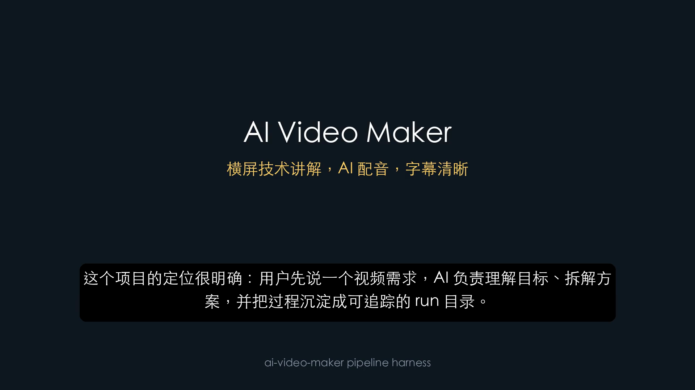

# 实操记录：P1 Pipeline Harness 自我介绍 Demo

更新时间：2026-06-08

## 1. 本次目标

本次把 P0 的硬编码 `run-demo` 升级为 P1 pipeline harness。

目标是让用户用一个配置文件驱动视频制作流程：

```text
pipeline.yml
-> brief.yml
-> brief gate
-> storyboard / asset_plan / capability_plan / narration
-> plan gate
-> voice / subtitles
-> render
-> qa
-> package
```

本次仍然只做横屏 YouTube 版，不上传 YouTube，不调用 `$browser`、`$chrome`、`$computer-use`。

## 2. 新增能力

新增命令：

```text
ai-video-maker run
ai-video-maker status
```

`run` 支持两种模式：

```bash
ai-video-maker run --pipeline pipeline.example.yml --run-id p1-pipeline-verify --overwrite
ai-video-maker run --run runs/p1-pipeline-verify
```

`status` 用于查看 run 状态、确认记录和 artifact 数量：

```bash
ai-video-maker status --run runs/p1-pipeline-verify
```

## 3. Gate 行为验证

### 3.1 创建 pipeline run

执行：

```bash
.venv/bin/ai-video-maker run \
  --pipeline pipeline.example.yml \
  --run-id p1-pipeline-verify \
  --overwrite
```

结果：

```text
waiting for brief approval
runs/p1-pipeline-verify
approve brief: ai-video-maker approve --run runs/p1-pipeline-verify --gate brief
```

说明：pipeline run 已创建，但没有直接生成 plan，也没有进入制作。

### 3.2 确认 brief

执行：

```bash
.venv/bin/ai-video-maker approve \
  --run runs/p1-pipeline-verify \
  --gate brief \
  --summary "确认介绍 AI Video Maker 项目的 brief"
```

继续推进：

```bash
.venv/bin/ai-video-maker run --run runs/p1-pipeline-verify
```

结果：

```text
waiting for plan approval
runs/p1-pipeline-verify
approve plan: ai-video-maker approve --run runs/p1-pipeline-verify --gate plan
```

说明：brief 通过后才生成 `plan/storyboard.yml`、`plan/asset_plan.yml` 和 `script/narration.zh.txt`。

### 3.3 确认 plan 并制作

执行：

```bash
.venv/bin/ai-video-maker approve \
  --run runs/p1-pipeline-verify \
  --gate plan \
  --summary "确认 storyboard、素材计划和旁白稿"
```

继续推进：

```bash
.venv/bin/ai-video-maker run --run runs/p1-pipeline-verify
```

结果：

```text
pipeline package ready
runs/p1-pipeline-verify
```

## 4. 最终状态

执行：

```bash
.venv/bin/ai-video-maker status --run runs/p1-pipeline-verify
```

结果：

```text
run: runs/p1-pipeline-verify
status: package_ready
current_stage: package
approvals:
  brief: approved
  plan: approved
  execution: pending
  upload: pending
  publish: pending
artifacts: 14
```

这说明 P1 gate 行为已经生效：

- `brief` 未确认，不生成 plan。
- `plan` 未确认，不进入配音、渲染、QA、打包。
- 本次不需要 GUI，所以 `execution` 保持 pending。
- `upload` 和 `publish` 保持 pending，不会自动上传或发布。

## 5. 产物

最终视频：

```text
runs/p1-pipeline-verify/render/final_16x9.mp4
```

视频信息：

| 项 | 结果 |
|---|---:|
| 时长 | 53.00 秒 |
| 大小 | 1,353,945 字节 |
| 比例 | 16:9 |
| 分辨率目标 | 1920x1080 |

发布包：

```text
runs/p1-pipeline-verify/package/
```

包含：

```text
video.mp4
title.txt
description.md
tags.txt
upload_checklist.md
```

## 6. QA 截图

P1 自动抽取关键帧：

```text
runs/p1-pipeline-verify/qa/screenshots/frame_6s.png
```

为方便文档展示，已复制到：

```text
docs/assets/p1-pipeline-frame-6s.png
```



## 7. 测试验证

配置校验：

```bash
.venv/bin/ai-video-maker validate --pipeline pipeline.example.yml
```

结果：

```text
pipeline valid
```

本次新增并运行单元测试：

```bash
.venv/bin/python -m unittest discover -s tests
```

结果：

```text
Ran 29 tests
OK
```

新增测试覆盖：

- CLI `run` / `status` 参数解析。
- CLI `validate` 参数解析。
- CLI `capabilities` 参数解析。
- pipeline 初始化只生成 brief。
- brief gate 通过后才生成 plan。
- GUI capability required 时必须等待 execution gate。
- capability adapter dry-run 计划生成。
- pipeline schema 校验。
- pipeline 完成后清理 stale `next_action`。

## 8. 当前结论

P1 pipeline harness 已经完成最小闭环：

```text
配置驱动
-> 分阶段确认
-> 可暂停推进
-> 状态可查询
-> 产物可追踪
-> 本地视频制作和发布包生成
```

下一步建议：

1. 增加仓库讲解、产品演示、SOP 教程三个模板。
2. 增加 `pipeline.yml` 到 run 的更细粒度 resume 策略。
3. 为 YouTube 上传包增加 metadata QA。
4. 接入 `$browser` 做第一个本地 Web Demo 录制前检查。
