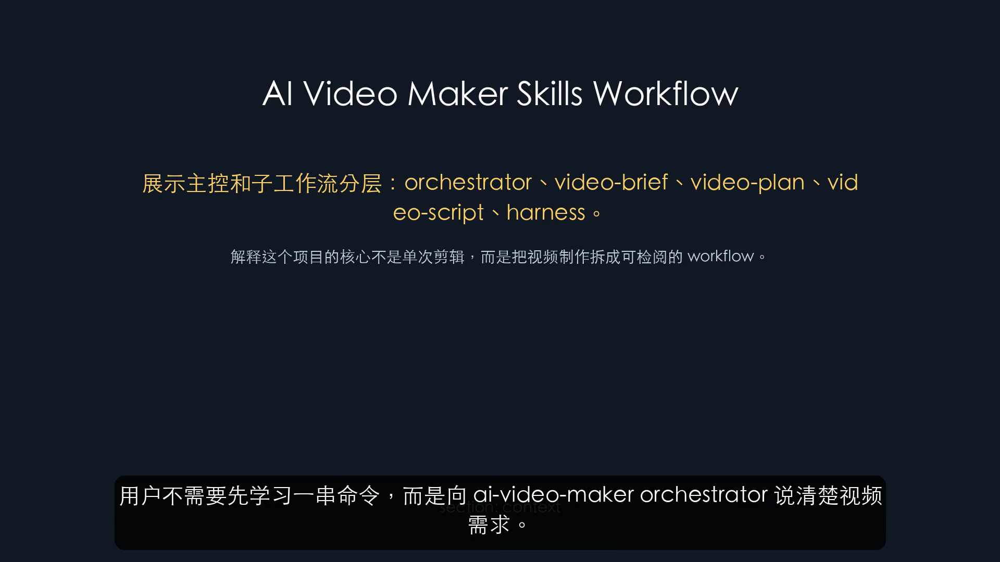

# 实操记录：Skills-First 自我介绍 Demo

更新时间：2026-06-08

本记录验证 `ai-video-maker` orchestrator 引导 `video-brief -> video-plan -> video-script -> voice-subtitle -> edit-render -> qa-revision -> publish-package` 的横屏 YouTube 本地制作链路。

本次没有执行真实网页录屏、上传或发布。CLI 只作为 skill 内部 harness 使用。

## 1. Demo 目标

输入需求：

```text
介绍 AI Video Maker 项目自己：重点演示用户如何通过 ai-video-maker orchestrator 和 video-brief、video-plan、video-script 子 skills，把一句视频需求推进成可检阅的视频制作方案。
```

目标平台：

```text
YouTube 横屏 16:9
```

模板：

```text
templates/pipelines/skills_self_intro_demo.yml
```

Run：

```text
runs/skills-first-self-intro-demo-v2
```

说明：`runs/` 是本地运行产物目录，默认不提交到 Git。

## 2. Step 1：video-brief

Orchestrator 建议先进入：

```text
video-brief
```

内部 harness 创建 run 后停在：

```text
awaiting_brief_approval
```

生成：

```text
runs/skills-first-self-intro-demo-v2/brief.yml
```

brief 检阅项：

- 目标是否是介绍 AI Video Maker 的 skills-first 工作流。
- 是否明确 YouTube 横屏 16:9。
- 是否明确不自动上传、不使用 Chrome 登录态、不做桌面 GUI。
- 是否验证到 `publish-package`，并保持 `upload`、`publish` gate 为 pending。

本次确认 brief 后，下一步建议：

```text
video-plan
```

## 3. Step 2：video-plan

`video-plan` 根据已确认 brief 生成：

```text
runs/skills-first-self-intro-demo-v2/plan/storyboard.yml
runs/skills-first-self-intro-demo-v2/plan/asset_plan.yml
runs/skills-first-self-intro-demo-v2/plan/capability_plan.yml
runs/skills-first-self-intro-demo-v2/script/narration.zh.txt
```

关键检查结果：

```text
target_duration: 75
section duration sum: 75
browser required: false
chrome required: false
computer-use required: false
```

storyboard 已包含可执行视觉提示：

```text
hook: 标题卡，展示“需求 -> skills -> 视频包”
context: 展示 orchestrator、video-brief、video-plan、video-script、harness 分层
steps: 展示 brief gate、plan gate、soft review、next_skill_suggestion
result: 展示 brief.yml、storyboard.yml、asset_plan.yml、capability_plan.yml、narration.zh.txt
summary: 引导进入 browser-capture、voice-subtitle、edit-render
```

本次确认 plan 后，下一步建议：

```text
video-script
```

## 4. Step 3：video-script

新增内部 harness 命令：

```bash
".venv/bin/ai-video-maker" script --run "runs/skills-first-self-intro-demo-v2"
```

该命令要求 `plan` gate 已确认。它不会录屏、配音、渲染、上传或发布。

生成：

```text
runs/skills-first-self-intro-demo-v2/script/screen_actions.md
runs/skills-first-self-intro-demo-v2/script/subtitle_draft.srt
runs/skills-first-self-intro-demo-v2/script/shot_notes.md
runs/skills-first-self-intro-demo-v2/script/handoff.video-script.yml
```

handoff 结果：

```yaml
skill: video-script
status: ready_for_review
next_skill_suggestion: voice-subtitle
revision_skill_suggestion: video-script
user_action_required: false
risks: []
```

当前 run 状态：

```text
status: script_ready
current_stage: script
next_action: review script; next skill: voice-subtitle
approvals:
  brief: approved
  plan: approved
  execution: pending
  upload: pending
  publish: pending
artifacts: 10
```

## 5. Step 4：voice-subtitle

新增内部 harness 命令：

```bash
".venv/bin/ai-video-maker" voice-subtitle --run "runs/skills-first-self-intro-demo-v2"
```

该命令要求 `script/handoff.video-script.yml` 存在，并来自 `video-script`。

生成：

```text
runs/skills-first-self-intro-demo-v2/audio/narration.mp3
runs/skills-first-self-intro-demo-v2/subtitles/captions.srt
runs/skills-first-self-intro-demo-v2/subtitles/handoff.voice-subtitle.yml
```

本次实跑结果：

```text
audio/narration.mp3: 417.5K
subtitles/captions.srt: 1.2K
status: voice_subtitle_ready
next_action: review voice/subtitles; next skill: edit-render
```

handoff 结果：

```yaml
skill: voice-subtitle
status: ready_for_review
next_skill_suggestion: edit-render
revision_skill_suggestion: voice-subtitle
user_action_required: false
risks: []
```

本阶段发现并修复：

- `edge-tts` 输出的字幕可能带 cue id，转换器已支持。
- 字幕时间戳可能使用英文句点或中文逗号毫秒格式，转换器已兼容。
- 相邻字幕可能有几十毫秒重叠，转换器会把上一条结束时间裁到下一条开始时间。
- 如果 TTS 字幕为空，会用 `script/subtitle_draft.srt` 兜底，避免把 0B 字幕交给后续渲染。

下一步建议：

```text
edit-render
```

## 6. Step 5：edit-render

新增内部 harness 命令：

```bash
".venv/bin/ai-video-maker" edit-render --run "runs/skills-first-self-intro-demo-v2"
```

该命令要求 `subtitles/handoff.voice-subtitle.yml` 存在，并来自 `voice-subtitle`。

生成：

```text
runs/skills-first-self-intro-demo-v2/render/draft.mp4
runs/skills-first-self-intro-demo-v2/render/final_16x9.mp4
runs/skills-first-self-intro-demo-v2/render/handoff.edit-render.yml
```

本次实跑结果：

```text
draft.mp4: 3.3M
final_16x9.mp4: 2.1M
status: edit_render_ready
next_action: review render; next skill: qa-revision
```

handoff 结果：

```yaml
skill: edit-render
status: ready_for_review
next_skill_suggestion: qa-revision
revision_skill_suggestion: edit-render
user_action_required: false
```

本次没有 browser capture 素材，因此使用 storyboard 卡片成片。`edit-render` 已支持在存在 `assets/browser/demo.webm` 时插入录屏片段，形成“录屏 + 卡片混剪”。

## 7. Step 6：qa-revision

新增内部 harness 命令：

```bash
".venv/bin/ai-video-maker" qa-revision --run "runs/skills-first-self-intro-demo-v2"
```

生成：

```text
runs/skills-first-self-intro-demo-v2/qa/report.md
runs/skills-first-self-intro-demo-v2/qa/ffprobe.json
runs/skills-first-self-intro-demo-v2/qa/screenshots/frame_6s.png
runs/skills-first-self-intro-demo-v2/qa/handoff.qa-revision.yml
```

关键帧截图：



QA 结果：

```text
video_file: PASS
captions_non_empty: PASS
video_stream: PASS
audio_stream: PASS
keyframe_screenshot: PASS
status: qa_revision_ready
next_action: review QA; next skill: publish-package
```

handoff 结果：

```yaml
skill: qa-revision
status: ready_for_review
next_skill_suggestion: publish-package
revision_skill_suggestion: edit-render
user_action_required: false
```

## 8. Step 7：publish-package

新增内部 harness 命令：

```bash
".venv/bin/ai-video-maker" publish-package --run "runs/skills-first-self-intro-demo-v2"
```

生成：

```text
runs/skills-first-self-intro-demo-v2/package/video.mp4
runs/skills-first-self-intro-demo-v2/package/title.txt
runs/skills-first-self-intro-demo-v2/package/description.md
runs/skills-first-self-intro-demo-v2/package/tags.txt
runs/skills-first-self-intro-demo-v2/package/upload_checklist.md
runs/skills-first-self-intro-demo-v2/package/handoff.publish-package.yml
```

handoff 结果：

```yaml
skill: publish-package
status: ready_for_gate
next_gate: upload
next_skill_suggestion: null
revision_skill_suggestion: publish-package
user_action_required: true
```

确认 gate 状态：

```text
execution: pending
upload: pending
publish: pending
```

也就是说，发布包已经准备好，但没有上传或发布。

## 9. 本次发现和修复

### 9.1 Plan 不能是空壳

问题：

```text
旧 storyboard 只改了 target_duration，但 sections 仍然是模板时长，且 visual/narration 为空。
```

修复：

- `create_plan_from_pipeline` 现在会按 `target_duration` 缩放章节时长。
- 空 storyboard 会补默认章节。
- 空 visual/narration 会根据 pipeline 的 `source` 和 `must_show` 自动补齐。
- 新增测试覆盖章节时长合计和 visual/narration 非空。

### 9.2 video-script 需要 harness 落盘

问题：

```text
只有 narration.zh.txt，不足以支撑后续录屏、字幕和剪辑。
```

修复：

- 新增 `src/ai_video_maker/script_workflow.py`。
- 新增 `ai-video-maker script --run ...`。
- 输出 `screen_actions.md`、`subtitle_draft.srt`、`shot_notes.md`、`handoff.video-script.yml`。
- `script` 命令必须在 `plan` gate 已确认后执行。

### 9.3 字幕草稿要保护可读性

问题：

```text
初版 subtitle draft 句子过长，后续换行又把 ASCII token 和标点切坏。
```

修复：

- subtitle draft 自动换行。
- 保护 `ai-video-maker`、`orchestrator`、`video-script` 这类 ASCII token。
- 避免标点单独成行。

### 9.4 正式字幕不能是 0B

问题：

```text
edge-tts 生成了音频，但初版 VTT 转 SRT 逻辑没有识别 cue id，导致 captions.srt 为空。
```

修复：

- VTT 转 SRT 支持 cue id。
- 支持英文句点和中文逗号两种毫秒格式。
- 修正相邻字幕时间戳重叠。
- 如果 TTS 字幕为空，使用 `script/subtitle_draft.srt` 兜底。

### 9.5 渲染和 QA 需要独立 handoff

问题：

```text
渲染、QA、发布包如果只复用旧 stage，orchestrator 不知道下一步该调用哪个 skill。
```

修复：

- 新增 `edit-render`、`qa-revision`、`publish-package` 三个子 skill。
- 每个子 skill 都输出独立 handoff。
- QA 失败时会把返修建议路由到 `edit-render` 或 `voice-subtitle`。
- 发布包只生成本地文件，停在 `upload` gate。

## 10. 当前结论

`ai-video-maker` orchestrator 引导用户一步步调用子 skill 的设计可行。

本次最小链路已经跑通：

```text
用户需求
-> video-brief
-> brief gate
-> video-plan
-> plan gate
-> video-script
-> soft review
-> voice-subtitle
-> soft review
-> edit-render
-> soft review
-> qa-revision
-> soft review
-> publish-package
-> upload gate
```

下一步应该用真实主题打磨：

```text
repository_demo
project_intro
product_demo
```
